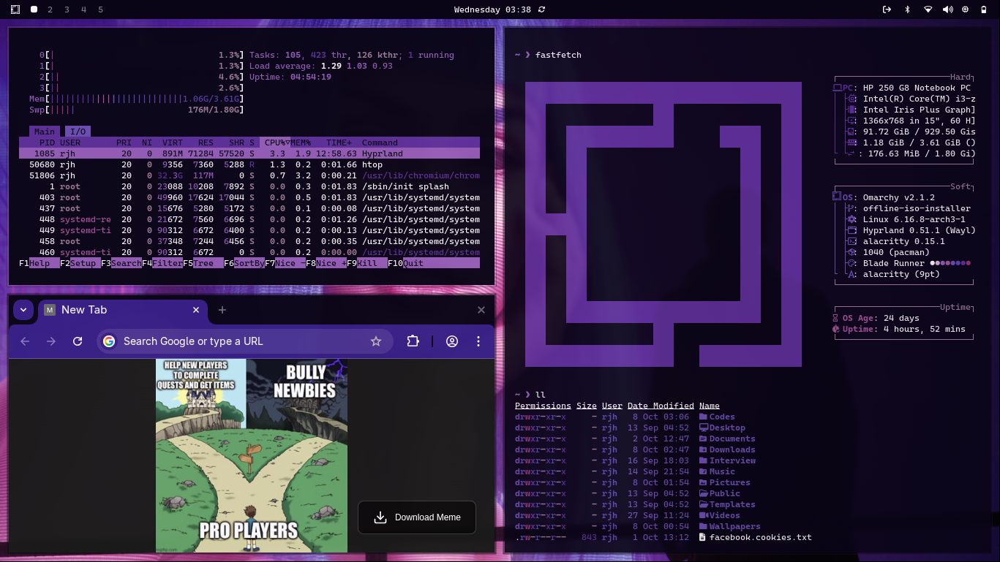

# omarchy blade runner theme

a cyberpunk-inspired theme for omarchy os, bringing the neon-soaked aesthetic of blade runner to your beautiful os.



## features

- **cyberpunk aesthetics**
- **vibrant colors**
- **blade runner wallpaper**

## credits

thanks to x user: [@iamdothash](https://x.com/iamdothash)

made using aether ❤️!

if you wanna know me then follow me on x.com [@bodha369](https://x.com/bodha369)

## installation

to install this theme, just simply use:

```
omarchy-theme-install https://github.com/dashaneka/omarchy-blade-runner-theme
```

or use the omarchy menu via `Super + Alt + Space` and select `Install > Style > Theme` to enter the github url of this repository.

## customization

feel free to modify the theme files to match your personal preferences. the main configuration files are located in the root directory.

## license

free to use and modify for personal and commercial projects.

## contributing

contributions, issues, and feature requests are welcome! feel free to fork and submit pull requests.

---

*"i've seen things you people wouldn't believe..."* ✨
